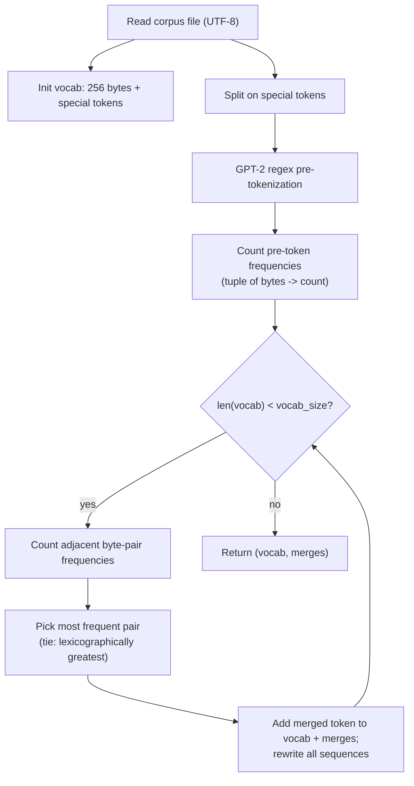

# CS336 Assignment1 — Design Note

This document describes the design of the byte-level Byte-Pair Encoding (BPE) tokenizer for CS336 Assignment 1. It covers two deliverables:


## Byte Pair Encoding(BPE)

### Initializing everything is `bytes`

Tokens are represented as Python `bytes` objects throughout. A pre-token such as `" the"` is first UTF-8 encoded, then represented as a sequence of single-byte `bytes` objects: `(b" ", b"t", b"h", b"e")`. Merges concatenate byte strings (`b"t" + b"h" -> b"th"`). This keeps the implementation Unicode-safe and matches the expected `dict[int, bytes]` / `list[tuple[bytes, bytes]]` output types.

### Pre-tokenization with the GPT-2 regex

Before any merging, text is split into **pre-tokens** using the GPT-2 regular expression:

```python
# Given in handout
PAT = r"""'(?:[sdmt]|ll|ve|re)| ?\p{L}+| ?\p{N}+| ?[^\s\p{L}\p{N}]+|\s+(?!\S)|\s+"""
```

- **Merges never cross pre-token boundaries.** A pair is only ever counted and merged *within* one pre-token. This prevents merges like `"e" + " "` from spanning word boundaries and reproduces GPT-2-style tokenization.

### Special tokens handling

Special tokens (e.g. `<|endoftext|>`) are document delimiters that must never be split apart or merged into other tokens. The corpus is first split on the special tokens, and any chunk equal to a special token is skipped entirely during training.

> [!NOTE]
> To support overlapping special tokens (e.g. both `<|endoftext|>` and `<|endoftext|><|endoftext|>`), the special tokens are sorted by length descending before building the split pattern, so the longest match wins.

When several adjacent pairs share the maximum frequency, the tie is broken by choosing the **lexicographically greatest pair**:

---

## 3. Training algorithm (`train_bpe`)



### 3.1 Vocabulary initialization

The base 256 byte tokens occupy IDs `0..255`; special tokens follow. Learned merges then occupy all subsequent IDs until `len(vocab) == vocab_size`.

### 3.2 Frequency table

Rather than operating on the full corpus, the algorithm operates on the set of **unique pre-tokens** plus their corpus frequencies. This is the central efficiency trick: identical pre-tokens (e.g. the thousands of occurrences of `" the"`) are processed once and weighted by their count.

### 3.3 Merge loop

Each iteration:

1. **Select the best pair** by `(count, pair)` directly from `pair_counts`
2. **Record** the new token: append the pair to `merges` and add `a+b` to `vocab`.
3. **Rewrite only affected sequences.** Look up `pair_to_seqs[best_pair]` to get exactly the sequences containing the chosen pair. For each such sequence:
   subtract its current pair contributions from `pair_counts` / `pair_to_seqs`, rewrite it left-to-right (replacing the chosen adjacent pair with the merged token), then add its new pair contributions back. Sequences that do not contain the pair are never touched.

The loop stops when the vocabulary reaches `vocab_size`, or earlier if no pairs remain (`pair_counts` empty).

### 3.4 Complexity & known limitations

Let `V` = number of unique pre-tokens, `L` = average sequence length, `M` = number of merges (`vocab_size - 256 - num_special`), and `P` = number of distinct adjacent pairs currently present.

The pair statistics (`pair_counts`, `pair_to_seqs`) are built once in `O(V * L)`. Each merge then only rewrites the sequences that actually contain the chosen pair (found via `pair_to_seqs`), updating the counts incrementally, plus an `O(P)` scan to pick the best pair.